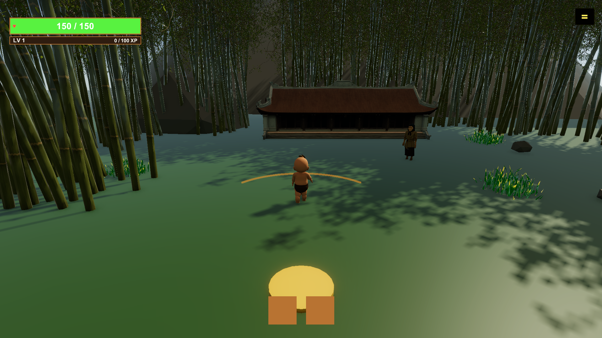
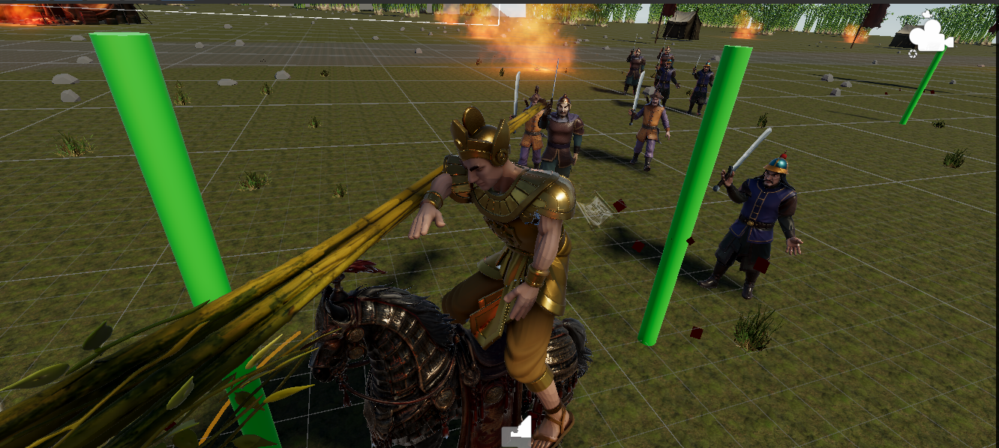
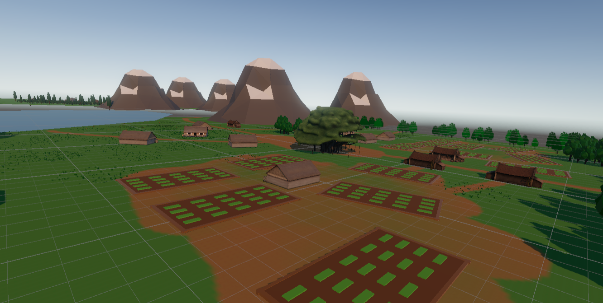
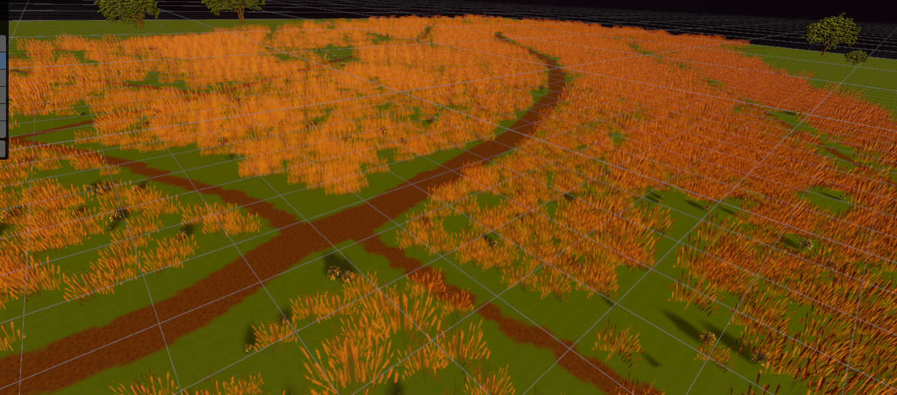
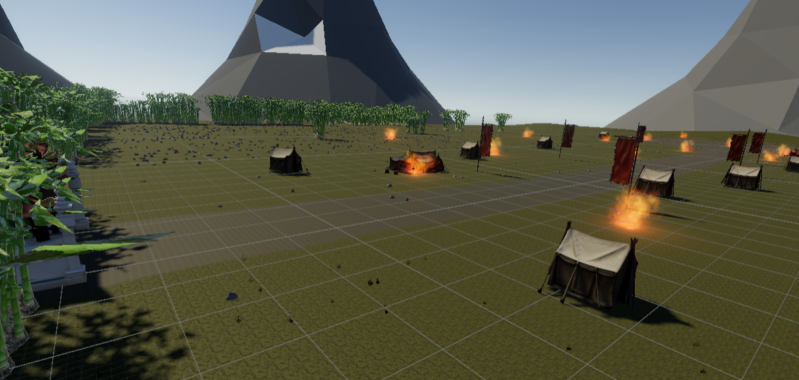
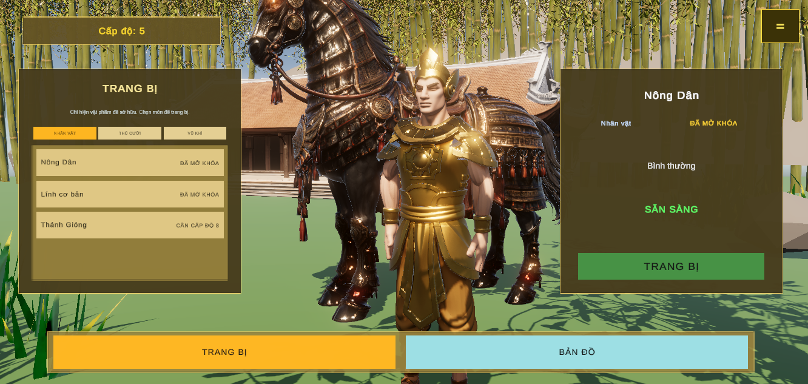
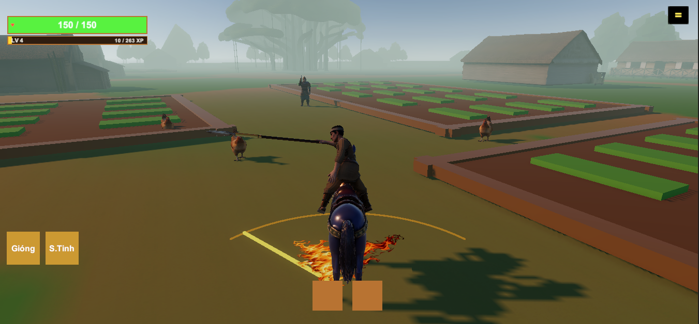
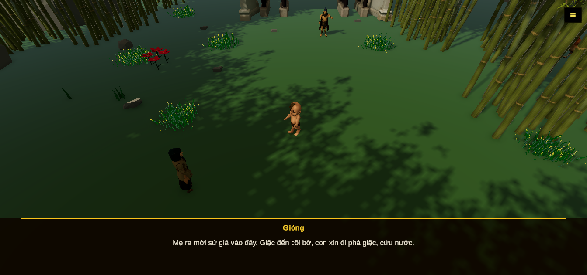
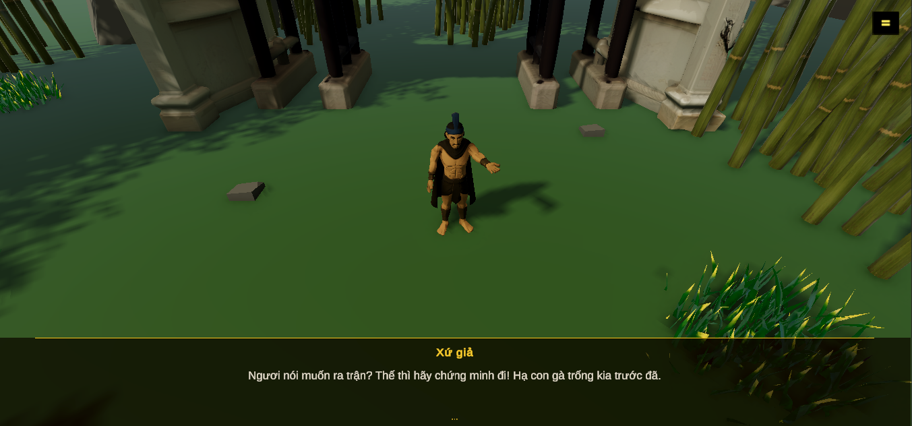

# Game 3D Thánh Gióng (Thanh Giong Game)

[](https://unity.com/)
[](https://unity.com/srp/Universal-Render-Pipeline)
[](LICENSE)

> **Game 3D Thánh Gióng** là dự án game nhập vai hành động 3D được phát triển trên nền tảng **Unity 6.3 LTS** và **Universal Render Pipeline (URP)**, lấy cảm hứng từ truyền thuyết dân gian Việt Nam — Thánh Gióng cưỡi ngựa sắt, cầm tre ngà đánh đuổi giặc Ân bảo vệ quê hương.

---

## Gameplay Showcase (Video Demo)

Click vào hình ảnh bên dưới để xem video trải nghiệm Gameplay trên YouTube:

<div align="center">
  <a href="https://youtu.be/qxTnkeCKk-o" target="_blank">
    
  </a>
  <p><i>Xem Video Gameplay Demo trên YouTube: <a href="https://youtu.be/qxTnkeCKk-o">https://youtu.be/qxTnkeCKk-o</a></i></p>
</div>

---

## Hình Ảnh Demo (Screenshots Gallery)

<div align="center">

| Ảnh 1 | Ảnh 2 | Ảnh 3 |
| :---: | :---: | :---: |
|  |  |  |

| Ảnh 4 | Ảnh 5 | Ảnh 6 |
| :---: | :---: | :---: |
|  |  |  |

| Ảnh 7 | Ảnh 8 | Ảnh 9 |
| :---: | :---: | :---: |
|  |  |  |

</div>

---

## Hướng Dẫn Chơi (How to Play & Controls)

### Mục tiêu trò chơi
- **Chiến đấu & Sống sót**: Tiêu diệt các làn sóng kẻ địch (giặc Ân, lính ném lao, lính cưỡi ngựa, quái gà...) qua từng đợt (Wave).
- **Khám phá bản đồ**: Di chuyển qua các khu vực bản đồ (Làng quê, Đồng bằng, Rừng tre) để tiêu diệt toàn bộ giặc bảo vệ dân làng.

### Phím điều khiển (Controls)

| Thao tác | Phím thực hiện / Cơ chế |
| :--- | :--- |
| **Di chuyển** | <kbd>W</kbd> <kbd>A</kbd> <kbd>S</kbd> <kbd>D</kbd> hoặc Phím mũi tên (<kbd>↑</kbd> <kbd>←</kbd> <kbd>↓</kbd> <kbd>→</kbd>) |
| **Chạy nhanh (Sprint)** | Giữ phím <kbd>Shift</kbd> (Left / Right Shift) khi di chuyển tiến |
| **Tấn công (Attack)** | **Tự động vung vũ khí (Auto-Attack)** theo chu kỳ |
| **Điều hướng góc chém** | **Di chuyển chuột Trái / Phải** để chỉnh hướng chém (Trái / Giữa / Phải) |
| **Kỹ năng 1 (Sky Plunge)** | Phím <kbd>1</kbd> (hoặc Click Icon trên UI) |
| **Kỹ năng 2 (Flame Dash)** | Phím <kbd>2</kbd> (hoặc Click Icon trên UI) |
| **Tương tác / Hội thoại** | Phím <kbd>E</kbd> / <kbd>Space</kbd> / <kbd>Chuột trái</kbd> |
| **Tạm dừng Game (Pause)** | Phím <kbd>ESC</kbd> |

---

## Các Bản Đồ Trong Game (Maps & Environments)

Game gồm 3 bản đồ chiến trường độc đáo với bối cảnh và thử thách tăng dần:

| Bản Đồ | Tên Bản Đồ | Mô Tả & Bối Cảnh | Điều Kiện Mở Khóa |
| :--- | :--- | :--- | :--- |
| **Map 1** | **Trong Làng (Nhà Lá)** | Đồng quê Việt Nam mộc mạc với những mái nhà lá đơn sơ, cây cối xanh mát và ruộng vườn thanh bình. | Mặc định (Có sẵn) |
| **Map 2** | **Đồng Bằng (Chiến Trường)** | Nơi lính ngoại xâm kéo vào đánh phá làng quê đồng bằng hiểm nguy, đầy vách đá dựng đứng, cây cối và đuốc cháy. | Hoàn thành Map 1 |
| **Map 3** | **Rừng Tre (Bamboo Forest)** | Rừng tre sâu thẳm rậm rạp rợp bóng tre xanh mát, phủ đầy cỏ dại rừng già cùng đom đóm huyền ảo dưới trăng. | Hoàn thành Map 2 |

---

## Tính Năng Nổi Bật (Key Features)

### 1. Cơ Chế Chiến Đấu & Điều Hướng Chuột
- **Tấn công tự động & Điều hướng chém**: Nhân vật tự động vung vũ khí theo chu kỳ. Người chơi rê chuột sang Trái / Giữa / Phải để điều chỉnh hướng chém linh hoạt.
- **Bộ kỹ năng đặc biệt**: 
  - **Trảm Thiên (Sky Plunge)**: Nhảy cao giậm đất tạo sóng xung kích gây sát thương diện rộng.
  - **Lướt Lửa (Flame Dash)**: Lướt nhanh về phía trước thiêu rụi kẻ địch trên đường đi.

### 2. Lối Chơi Rogue-lite & Hệ Thống Nâng Cấp

- **Hệ thống Lên cấp & Chọn thẻ (Level-Up System)**: Thu thập ngọc kinh nghiệm (XP Orbs) rơi từ quái để tăng cấp và lựa chọn các thẻ nâng cấp chỉ số/kỹ năng.
- **Sức mạnh Truyền Thuyết Việt Nam**: Tích hợp các bộ kỹ năng mang dấu ấn thần thoại dân gian (Thánh Gióng, Cổ Loa, Đông Á, Lê Lợi, Sơn Tinh).

### 3. Đợt Quái Tấn Công & Trận Chiến Boss
- **Làn sóng giặc Ân (Wave System)**: Kẻ địch xuất hiện theo từng đợt với độ khó tăng dần qua thời gian.
- **Đấu Trùm kịch tính**: Boss có các kỹ năng diện rộng có cảnh báo đường đỏ và chuyển giai đoạn biến hình.

### 4. Cửa Hàng & Trang Bị Nhân Vật
- **Nâng cấp trang bị (Tier 1 - Tier 4)**: Thay đổi và mở khóa các cấp độ Ngựa sắt, Nhân vật và Vũ khí.
- **Vật phẩm bổ trợ (Loadout Buff)**: Mua các chỉ số Máu, Sát thương và Tốc độ chạy trước khi bước vào trận chiến.

### 5. Màn Chơi Hướng Dẫn & Cốt Truyện
- Tích hợp chuỗi hướng dẫn tân thủ chi tiết cùng hệ thống hội thoại NPC dẫn dắt người chơi bước vào hành trình Thánh Gióng đánh đuổi giặc Ân bảo vệ quê hương.

---

## Công Nghệ Sử Dụng (Tech Stack)

- **Game Engine**: Unity 6.3 LTS
- **Render Pipeline**: Universal Render Pipeline (URP)
- **Language**: C# (.NET Core / Mono)
- **GUI & Typography**: TextMesh Pro
- **Version Control**: Git / Git LFS

---

## Cấu Trúc Dự Án (Project Structure)

```text
ThanhGiongGame/
├── Assets/                 # Tài nguyên chính (Scripts, Prefabs, Models, Audio, Materials)
│   ├── Scripts/            # Mã nguồn C# (MapManager, WaveSpawner, PlayerController...)
│   ├── Prefabs/            # Các Prefab vật thể, quái vật, nhân vật
│   └── TextMesh Pro/       # Phông chữ & UI assets
├── images/                 # Thư mục chứa hình ảnh screenshot (1.png - 9.png)
├── ProjectSettings/        # Thiết lập cấu hình Unity (Input, Graphics, Quality, Tag...)
├── Packages/               # Các gói phụ thuộc Unity PackageManager (URP, TMP...)
├── BaoCaoThayDoi.txt       # Nhật ký chi tiết cập nhật và tối ưu hóa hệ thống
├── .gitignore              # Cấu hình bỏ qua file tạm Unity cho Git
└── README.md               # Tài liệu hướng dẫn dự án
```

---

## Hướng Dẫn Cài Đặt & Chạy Dự Án

### Yêu cầu tiên quyết
1. Đã cài đặt **Unity Hub**.
2. Đã cài đặt phiên bản **Unity 6.3 LTS** (hỗ trợ URP).

### Các bước mở dự án
1. Clone dự án về máy:
   ```bash
   git clone https://github.com/UGing265/ThanhGiongGame.git
   ```
2. Mở **Unity Hub** ➔ Chọn **Add** ➔ Trỏ tới thư mục `ThanhGiongGame`.
3. Mở dự án với phiên bản **Unity 6.3 LTS**.
4. Chờ Unity nạp Packages và Reimport tài nguyên.
5. Vào thư mục `Assets/Scenes` ➔ Mở Scene chính ➔ Bấm nút **Play** (`Ctrl + P`) để trải nghiệm game!

---

## Thành Viên Phát Triển (Team Members)

- **Giảng viên hướng dẫn**: HungLD
- **Team members**:
  - DevShiroru
  - Tecookie
  - BlueCloudK
  - Hieu080304

---

## Bản Quyền (Copyright)

© 2026 **DevShiroru** & Đội ngũ phát triển **Game 3D Thánh Gióng**. All rights reserved.

